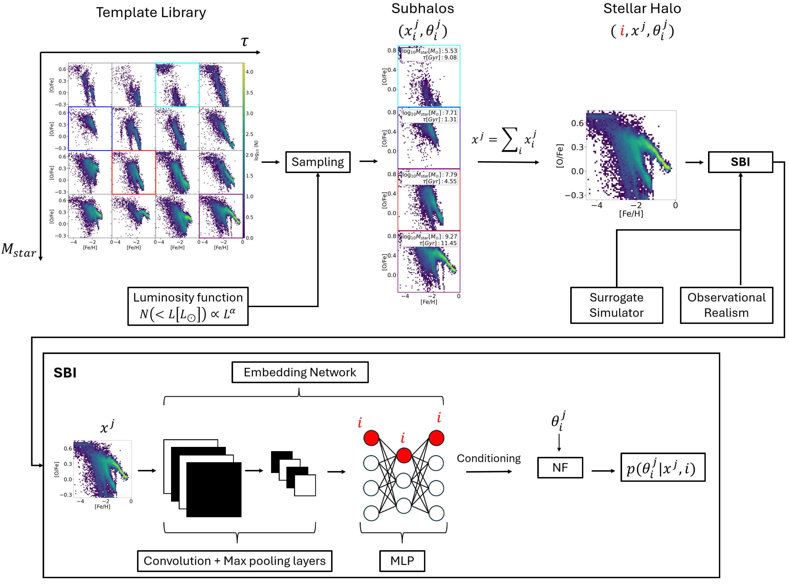

# Introduction and Installation

`CASBI` is a simulation based inference package to perform bayesian inference in the context of Galactic Archaeology.



::::

## Installation

`CASBI` can be installed by cloning the repo and then usin `pip`

```bash
git clone https://github.com/vepe99/CASBI.git
cd CASBI
pip install CASBI
```


:::{tip} The inference pipeline and the evaluation metric are presented in [simple example](notebooks/preprocessing.ipynb).

```{toctree}
:hidden:
:maxdepth: 2
:caption: Introduction

self
```

```{toctree}
:hidden:
:maxdepth: 2
:caption: Notebooks

notebooks/preprocessing.ipynb
notebooks/template_library_and_inference.ipynb
```

```{toctree}
:hidden:
:caption: Reference

apidocs/index
```